# Data Analytics Projects for Beginners

As a beginner, you need to focus on importing, cleaning, manipulating, and visualizing the data.

## Data Importing and Cleaning Projects

### 1. Exploring the NYC Airbnb Market

In the Exploring the NYC Airbnb Market project, you will apply data importing and cleaning skills to analyze the Airbnb market in New York. You will ingest and combine the data from multiple file types, and clean strings and format dates to extract accurate information.

**DataCamp Projects:** Exploring the NYC Airbnb Market
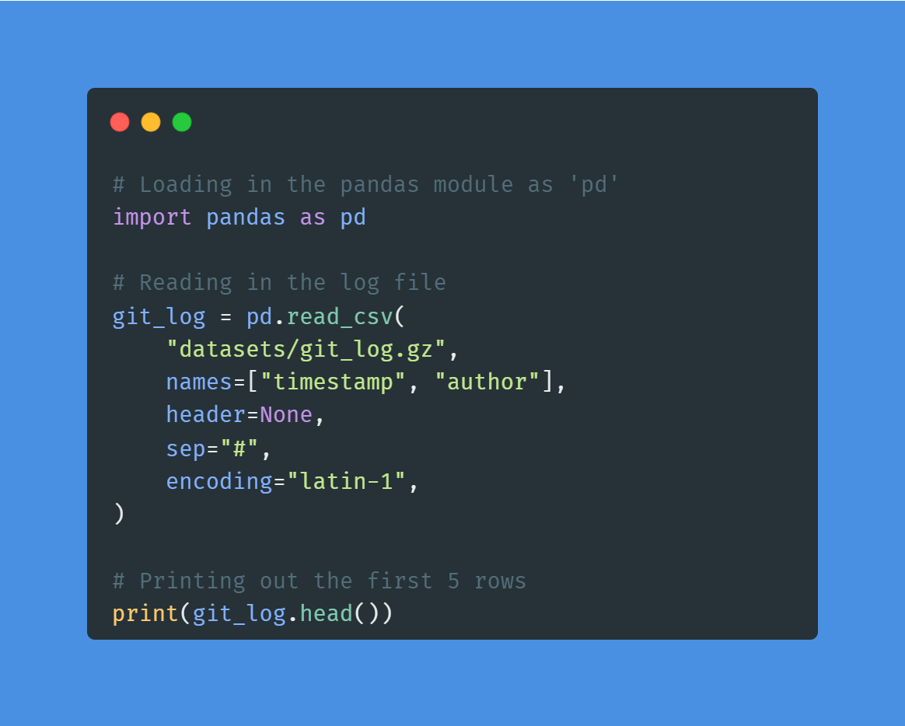
**Image by Author | Code from the project**

The project is perfect for beginners who want to get data importing and cleaning experience. You can apply similar methods to this Online Ticket Sales dataset to get even better at handling and processing the data.

Learn more about data importing and cleaning by taking short courses:

- Introduction to Importing Data in Python
- Cleaning Data in Python

### 2. Word Frequency in Classic Novels

In the Word Frequency in Classic Novels project, you will use requests and BeautifulSoup to scrape a novel from the Project Gutenberg website. After scraping and cleaning the text data, you will use NLP to find the most frequent words in Moby Dick. The project introduces you to the world of Python web scraping and natural language processing.

**DataCamp Projects:** Word Frequency in Classic Novels
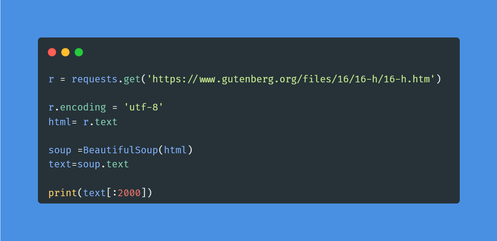
**Image by Author | Code from the project**

For data analysts and data scientists, web scraping is an essential skill to learn. You can take a short Web Scraping with Python course to understand the tools and components of an HTML web page.

## Data Manipulation Projects

### 3. Exploring the Bitcoin Cryptocurrency Market

In the Exploring the Bitcoin Cryptocurrency Market project, you will explore bitcoin and other cryptocurrency data. You will clean the dataset by discarding cryptocurrencies without market capitalization, comparing Bitcoin with other currencies, and preparing data for visualization.

**DataCamp Projects:** Exploring the Bitcoin Cryptocurrency Market
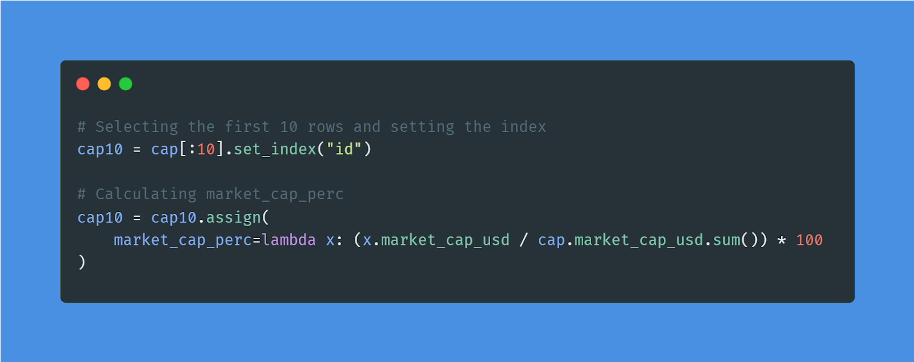
**Image by Author | Code from the project**

You can apply similar methods to Stock Exchange Data and learn to manipulate the data for data analysis. Furthermore, you can learn data transformation, aggregation, slicing, and indexing by taking Data Manipulation with pandas course.

### 4. Analyze Your Runkeeper Fitness Data

In the Analyze Your Runkeeper Fitness project, you will import, clean, manipulate, and analyze the seven years of Runkeeper’s training data. It is a perfect sample project for learning complex data filtering, transformation, and processing. Furthermore, you will analyze the data and present a detailed summary report.

**DataCamp Projects:** Analyze Your Runkeeper Fitness
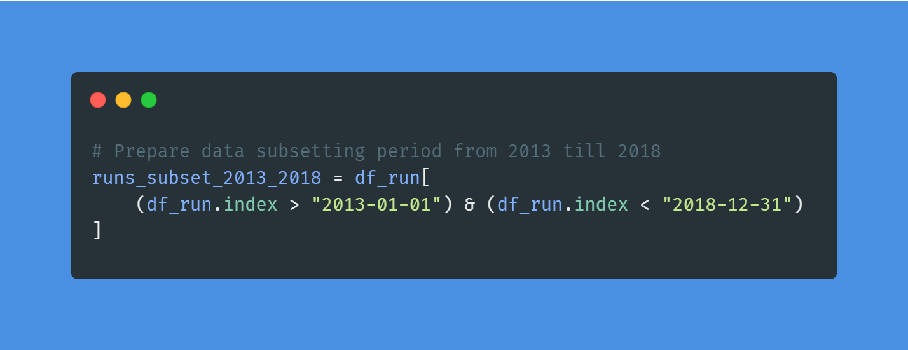
**Image by Author | Code from the project**

You can apply similar methods to NBA Shooting Data and gain more experience in data manipulation and analysis, or you can take Manipulating Time Series Data in Python course for handling complex time series datasets.

## Data Visualization Projects

### 5. Visualizing COVID-19

In the Visualizing COVID-19 project, you will visualize COVID-19 data using the most popular R library ggplot. You will analyze confirmed cases worldwide, compare China with other countries, learn to annotate the graph, and add a logarithmic scale. The project will teach you skills that are in high demand for R programmers.

**DataCamp Projects:** Visualizing COVID-19
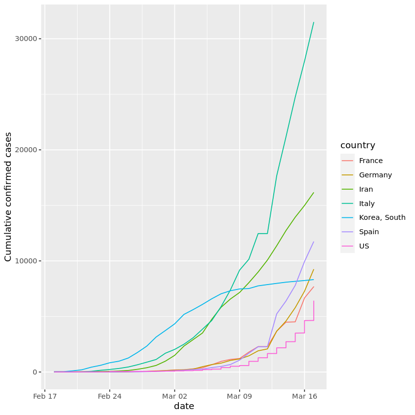
**Image from the project**

You can apply ggplot methods to Measles Data and gain more experience in data visualization and analysis. Moreover, you can take Intermediate Data Visualization with the ggplot2 course to learn the best data visualization practices.

### 6. The Android App Market on Google Play

In the Android App Market on Google Play project, you will import, clean, and visualize the Google Play Store data to understand the Android app market.

You will:

- Clean the data.
- Correct the data types.
- Explore app categories.
- Understand the distribution of app ratings, size, popularity, and price.
- Perform sentiment analysis on users' reviews.

**DataCamp Projects:** The Android App Market on Google Play
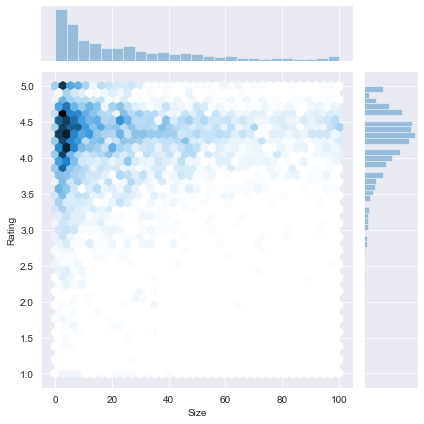
**Image from the project**

You can apply lessons learned from the project on a similar dataset: Google Play Store Apps to gain more experience in visualizing and exploring the data.

Using the code to display interactive data visualization is easy, but understanding and interpreting the data is hard. Take the Understanding Data Visualization course to explain visualization distribution and learn the best data visualization techniques to communicate complex data.

# Advanced Data Analytics Projects

For more advanced data analytics projects, you need command over mathematics, probability, and statistics. Furthermore, you will perform exploratory data and predictive analytics to understand the data in detail.

## Probability & Statistics Projects

### 7. Real-time Insights from Social Media Data

For the Real-time Insights from Social Media project, you will use various statistical tools to dive deep into Twitter’s hot trends. You will understand local and global patterns and common trends and perform frequency and language analysis.

**DataCamp Projects:** Real-time Insights from Social Media Data
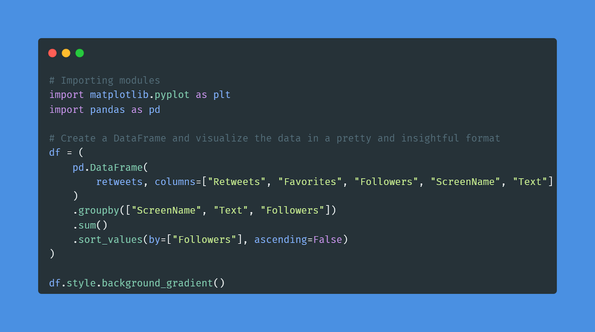
**Image by Author | Code from the project**

You can apply similar methods used in the project on a new dataset: Internet News and Consumer Engagement, and learn more about analyzing news trends and consumer behavior.

### 8. Find Movie Similarities from Plot Summaries

In the Find Movie Similarity from Plot Summaries project, you will use NLP and clustering to find the similarities between movie plots. It is the perfect project if you are looking to apply statistical techniques to text data.

You will import two datasets, combine them, perform tokenization and stemming, convert words into vectors, and use KMeans to perform clustering. Furthermore, you will calculate similarity distance and visualize the results using Matplotlib, Linkage, and Dendrograms.

**DataCamp Projects:** Find Movie Similarity from Plot Summaries
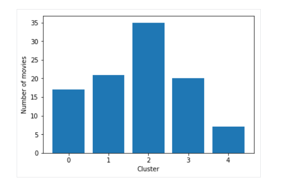
**Image from the project**

Use your lessons from the project and apply them to a new dataset: Netflix Movie Data, to get experience applying statistics to text data.

If you are interested in learning about the most common statistical techniques, probability, data distribution, correlation, and experimental design, take the Introduction to Statistics in Python course.

## Exploratory Data Analysis (EDA) Projects

### 9. Analyze International Debt Statistics

In the Analyze International Debt Statistics project, you will write SQL queries to explore and analyze international debt using the World Bank dataset. SQL is the most popular and essential tool for performing data analytics on the go.

In the project, you will be finding the:

- Distinct countries
- Distinct debt indicators
- Total amount of debt owed by the countries
- Country with the highest debt
- Average amount of debt across indicators
- The highest amount of principal repayments
- The most common debt indicator

**DataCamp Projects:** Analyze International Debt Statistics
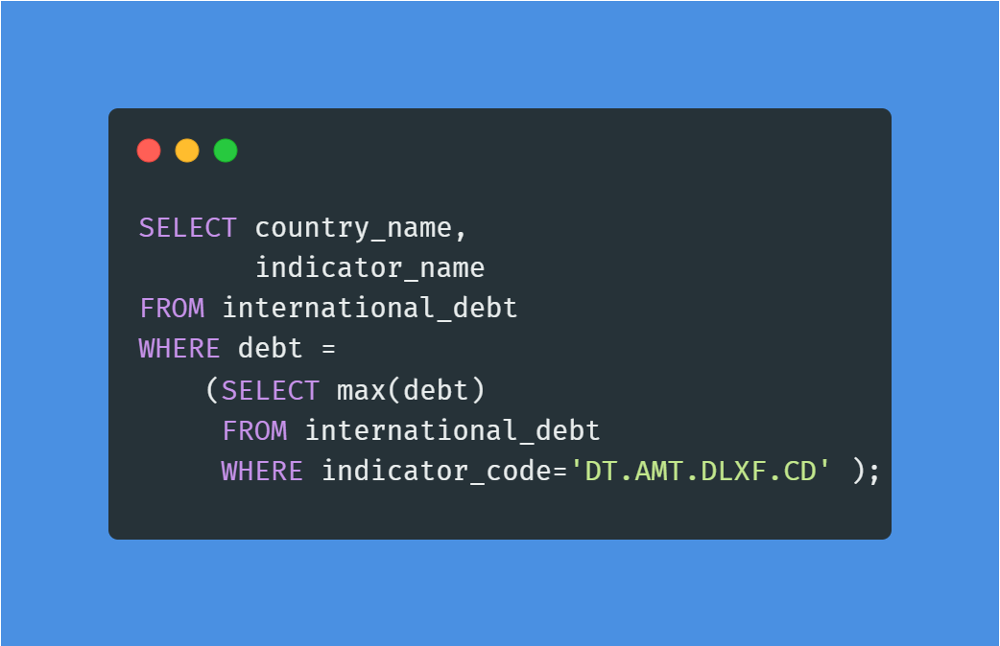
**Image by Author | Code from the project**

You will connect World Nations MariaDB dataset and apply similar queries to get additional experience in handling and analyzing SQL databases. Additionally, you can Exploratory Data Analysis in SQL course to advance techniques and queries in handling various SQL databases.

### 10. Investigating Netflix Movies and Guest Stars in The Office

In the Investigating Netflix Movies and Guest Stars in The Office project, you will use data manipulation and visualization to solve a real-world data science problem. You will perform deep exploratory data analysis and draw conclusions from detailed graphs.

**DataCamp Projects:** Investigating Netflix Movies and Guest Stars in The Office
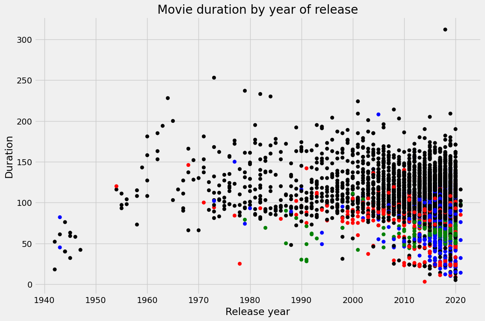
**Image from the project**

You can work on a portfolio project by applying similar skills to a new dataset: Netflix Movie Data. Furthermore, you can take Exploratory Data Analysis in Python to learn more about data cleaning and validation, understand the relationship and distribution, and explore multivariate relationships.

## Predictive Analytics Projects

### 11. Functions for Food Price Forecasts

In the Functions for Food Price Forecasts project, you will perform predictive analysis of food prices in Rwanda. You will import, wrangle, manipulate, and forecast data using R packages. It is perfect for beginners and professionals who are getting started with the R language and predictive analysis.

**DataCamp Projects:** Functions for Food Price Forecasts
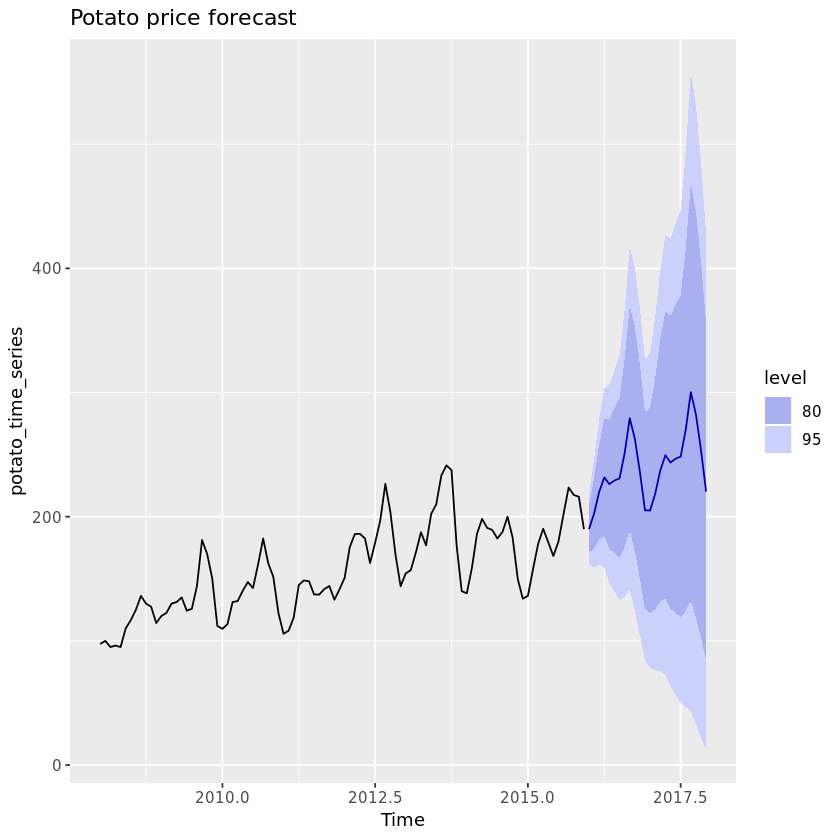
**Image from the project**

You can create a time-series forecast R function for Loan Data and get better at performing predictive analysis using R packages. Moreover, you can complete the Forecasting Product Demand in R course to learn more about forecasting demand with time series, blending regression, and hierarchical forecasting.

### 12. Predicting Credit Card Approvals

In the Predicting Credit Card Approvals project, you will build the best-performing machine learning model for predicting credit card application approvals.

First, you will understand the data and impute missing values. After that, you will preprocess the data and train a logistic regression model on the training set. In the end, you will evaluate the results and improve the model performance using Grid searching.

**DataCamp Project:** Predicting Credit Card Approvals
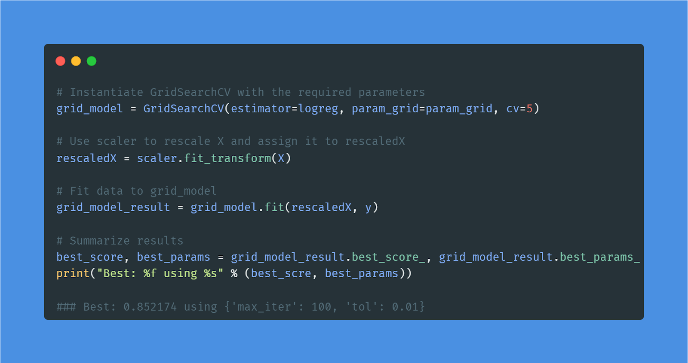
**Image by Author | Code from the project**

Applying simple machine learning algorithms is an essential part of a data analyst’s life. You can gain more experience by applying similar methods to a new dataset: Bank Marketing.

Learn more about classification, regression, fine-tuning, and preprocessing by taking a short Supervised Learning with the scikit-learn course.

# Data Analytics Projects for Final Year Students

Final year student projects are usually research-based and require at least 2-3 months to complete. You will be working on a specific topic and trying to improve the results using various statistical and probability techniques.

Note: there is a growing trend for machine learning projects for data analytics final-year projects.

### 13. Reducing Traffic Mortality in the USA

For the Reducing Traffic Mortality in the USA project, you will find a good strategy for reducing traffic-related deaths in the USA. You will be importing, cleaning, manipulating, and visualizing the data. Furthermore, you will perform feature engineering and apply various machine learning models (multivariate linear regression, KMeans clustering) to come up with stately and communicate the results.

**DataCamp Project:** Reducing Traffic Mortality in the USA
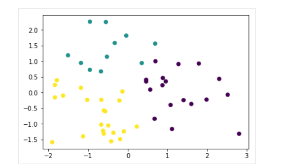
**Image from the project**

If you want to learn more about unsupervised learning, check out Cluster Analysis in Python course.

### 14. Classify Song Genres from Audio Data

In the Classify Song Genres from Audio project, you will apply machine learning algorithms to classify songs into genres.

You will be:

- Preparing the dataset
- Splitting them into train and test sets
- Normalize the data
- Apply PCA on scaled data
- Train decision tree and logistic regression compare the performance
- Balance the data for better performance
- Understanding model bias
- Apply cross-validation to evaluate our models

**DataCamp Project:** Classify Song Genres from Audio Data
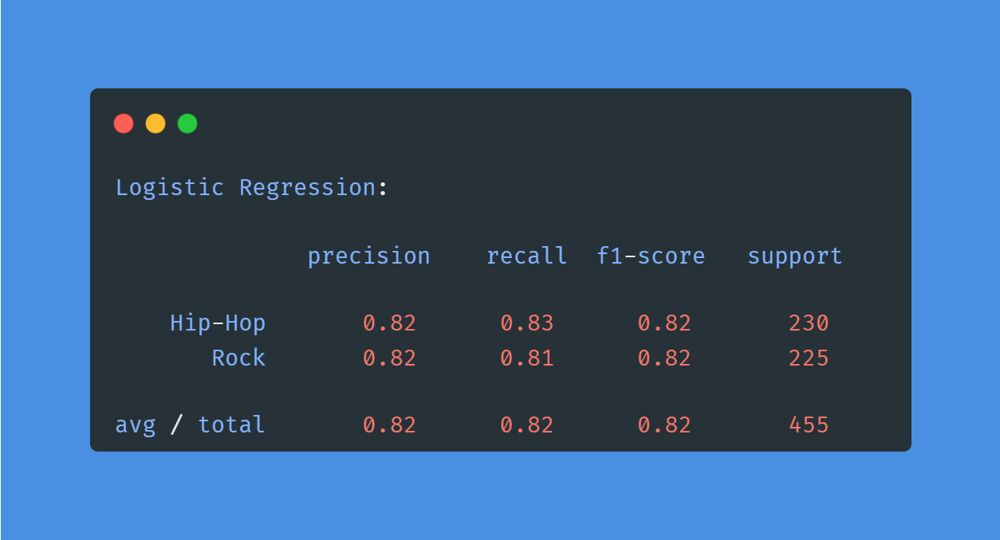
**Image by Author | Result from the project**

Learn more about logistic regression and SVM by taking Linear Classifiers in Python course.

### 15. World Population Analysis

The World Population Analysis project is the best example of performing deep exploratory analysis. You will be exploring various columns, visualizing the least and most populated countries, and exploring population density and growth rate. Furthermore, you will display the country rank distribution and correlation map.

**DataCamp Project:** World Population Analysis
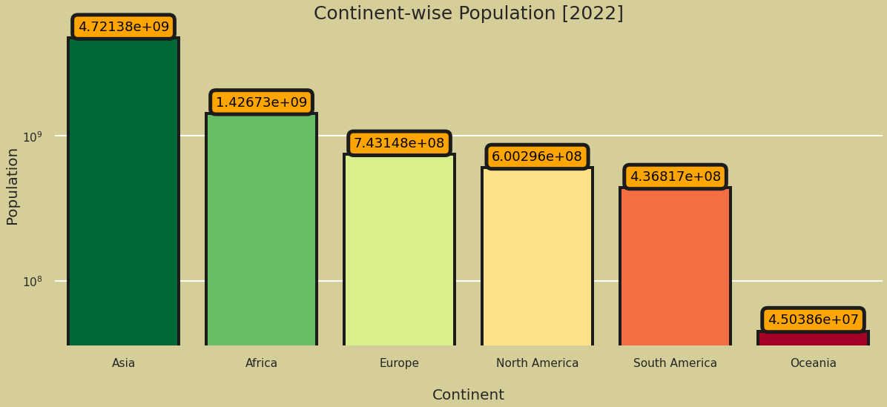
**Image from the project**

Learn easy ways to plot data visualization in Python by completing Intermediate Data Visualization with Seaborn course.

### 16. Data Science and MLOps Landscape in Industry

The Data Science and MLOps Landscape in Industry project is a holy grail for all data manipulation, visualizations, and exploratory and geospatial analysis. You will learn to effectively use box plots, doughnut charts, bar charts, heatmaps, parallel categorical graphs, bubble charts, funnel charts, radar charts, icicle charts, and maps. Furthermore, you will learn to interpret various types of graphs.

**DataCamp Project:** Data Science and MLOps Landscape in Industry
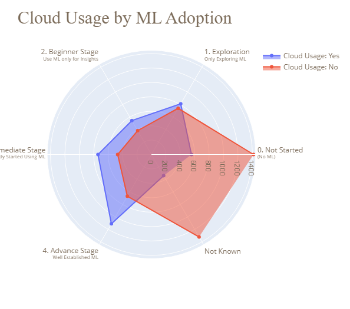
**Image from the project**

Take Introduction to Data Visualization with Plotly in Python course to learn about advanced Plotly features and customization.

# End-to-end Data Analytics Projects

End-to-end projects are great for your resume and understanding of the data analytic project life cycle.

In general, you will be:

- Dealing with multiple datasets
- Understanding the data distribution
- Applying data cleaning and manipulation
- Applying probability and statical techniques
- Performing data analysis and visualization
- Using machine learning model for predictive analysis
- Creating the report or dashboard

### 17. Predict Taxi Fares with Random Forests

In the Predict Taxi Fares with Random Forests project, you will be on taxi journeys in New York and use tree-based models to predict the value of fares and tips, based on location, date, and time. Furthermore, you will get familiar with popular R packages dplyr, ggplot2, and randomForests.

You will clean the data and visualize it on the map to understand ride hotspots, predict taxi fares using tree and random forest models, display the prediction on the map, and analyze the results.

**DataCamp Project:** Predict Taxi Fares with Random Forests
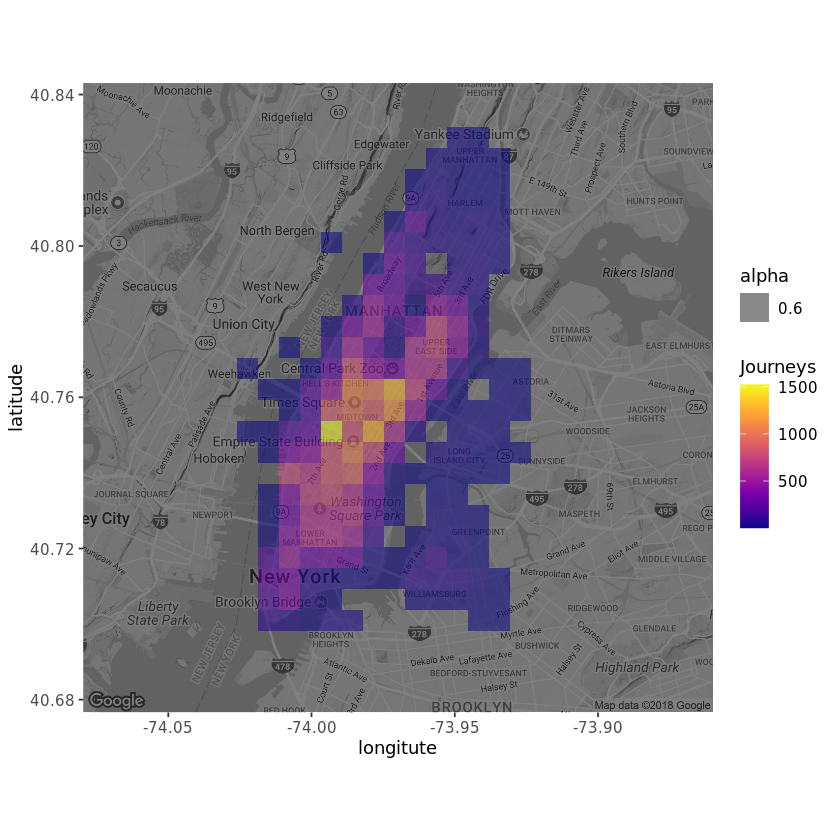
**Image from the project**

If you are new to R language tree-based models, take the Machine Learning with Tree-Based Models with R course and become an expert.

### 18. Mobile Games A/B Testing with Cookie Cats

A/B testing new features and products is a crucial part of a data analyst's job. In the Mobile Games A/B Testing with Cookie Cats project, you will analyze the result of A/B testing, where the first gate in Cookie Cats was moved from level 30 to level 40.

In detail, you will need to apply data manipulation, statistics, data visualization, and critical thinking to decide which version is the best.

**DataCamp Project:** Mobile Games A:B Testing with Cookie Cats
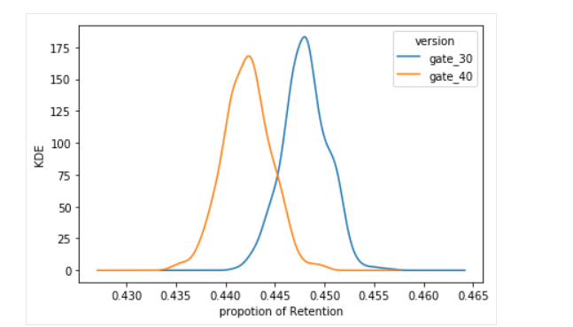
**Image from the project**

If you are new to A/B testing, try completing the Customer Analytics and A/B Testing in Python course to understand KPIs, explore and visualize customer behavior and application and analyze the results of A/B testing.

### 19. An End-to-End Project on Time Series Analysis and Forecasting with Python

In the Time Series Analysis and Forecasting project, you will dive deep into analyzing the trends, apply the ARIMA model for forecasting, compare the results, and visualize the results to understand the sales for both furniture and office supplies.

Time-series analysis and forecasting projects are in high demand in financial sectors, and they will help you land a high-paying job. The only thing you need to do is to interpret various trends and accurately forecast the numbers.

**DataCamp Project:** An End-to-End Project on Time Series Analysis and Forecasting with Python
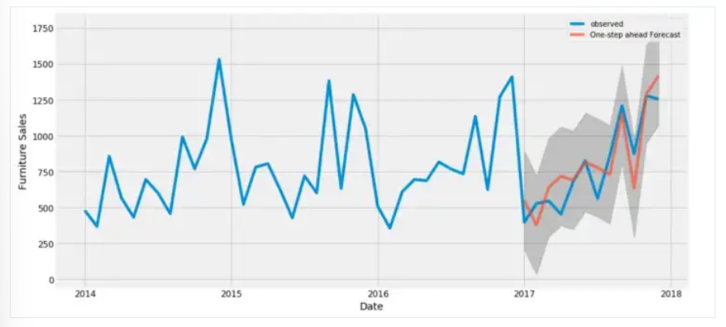
**Image from the project**

If you are struggling to analyze and forecast, try completing ARIMA Models in Python course to learn about ARMA models, fitting the future, selecting the best models, and training seasonal ARIMA models.

### 20. Build a multi-objective recommender system

The goal of Build a multi-objective recommender system project is to predict e-commerce clicks, cart additions, and orders. In short, you will be creating a multi-objective recommender system based on previous events in a user session.

Upon completing the project, you will master:

- Data manipulation and analysis
- Understand sessions and events
- Data visualization and reporting
- Handling time series data
- Analyze time series data to explore user behavior
- Predict top clicks, carts, and orders

**DataCamp Project:** Build a multi-objective recommender system
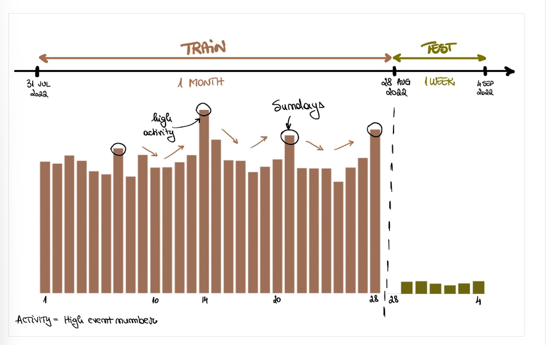
**Image from the project**
